# CallumRowston_T1A2 Portfolio Website Documentation

# [Website](https://callumrowston.netlify.app/)

# [Github Repo](https://github.com/CallumRowston/Portfolio-Website-Assessment)

# [Presentation - Youtube](https://youtu.be/9Gcpqo6MJDU)

## Purpose

This portfolio website is designed to exhibit my background, contact information, (future) projects and my ability to design, develop and deploy a website. 

## Target Audience

The website aims to attract potential employers and recruiters in the area of software development and give them information about my skills and history.

## Funtionality and Features

The website is designed to be fully responsive to varying screen sizes. It uses semantic HTML together with thematic colour and animations to convey information clearly and concisely and create an accessible experience. The website is navigated by a top navigation bar to access different pages. 

The website pages include:

- Home Page - Introduces myself with a message and profile picture. It also has  quick links to social media accounts.
- About Page - Provides information about me; includiung my background, work and study history and my personal interests. Also links to my resume.
- Contact Page - Provides multiple avenues to contact me; email, phone and social media.
- Projects Page - Designed to show my capabilities as a software developer by exhibiting projects I have worked on.
- Blog Main Page - Gives an overview of current blog posts and links to those full blog posts.
- Blog Individual Page - Contains a blog post with placeholder image and text. 

## Sitemap

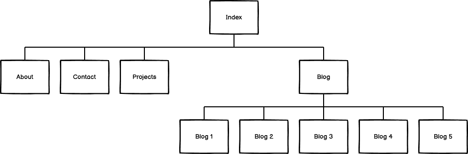

## Wireframes and Screenshots

### Index Page

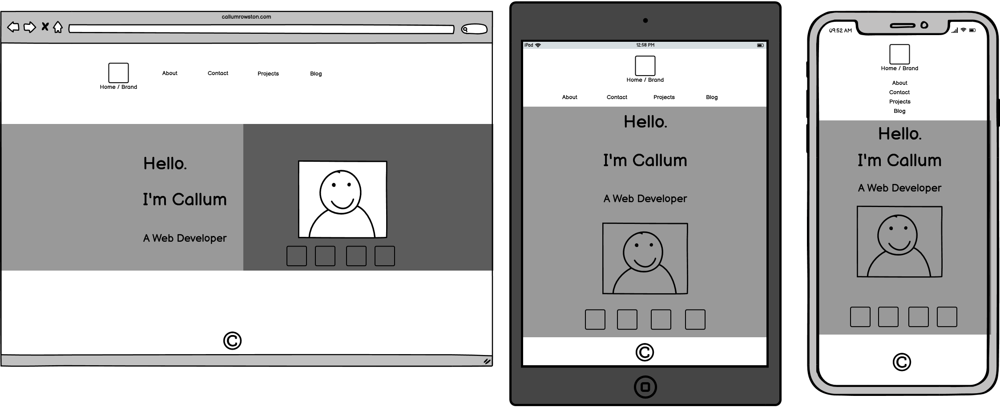
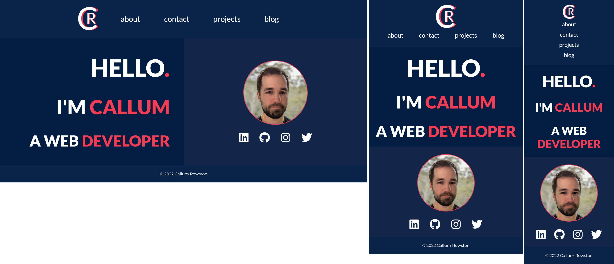

### About Page

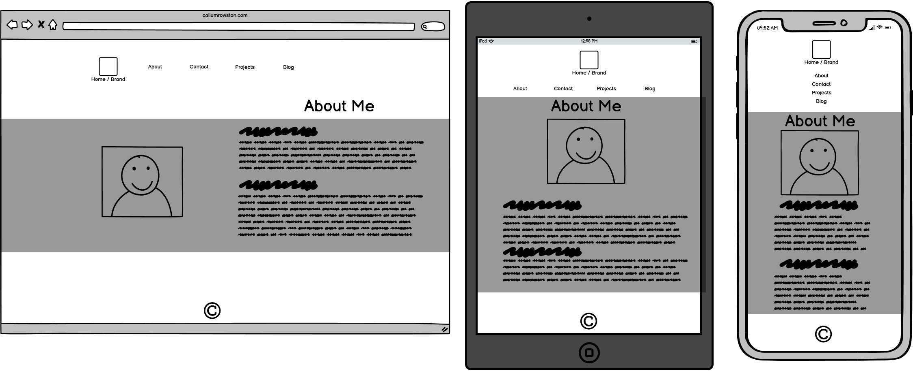
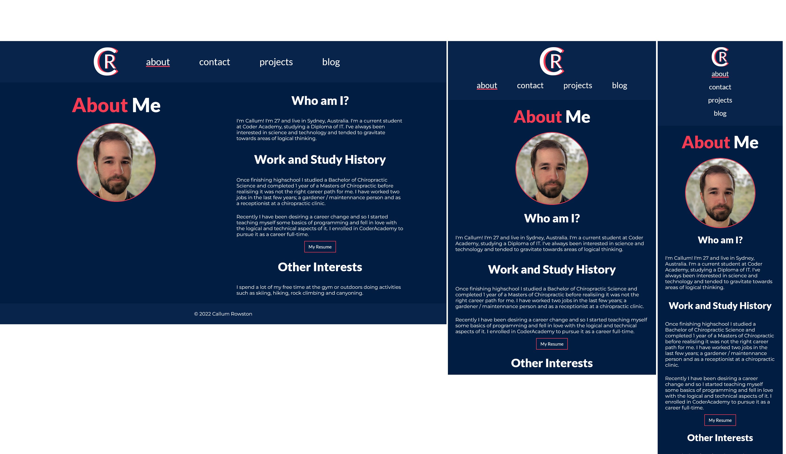

### Contact Page

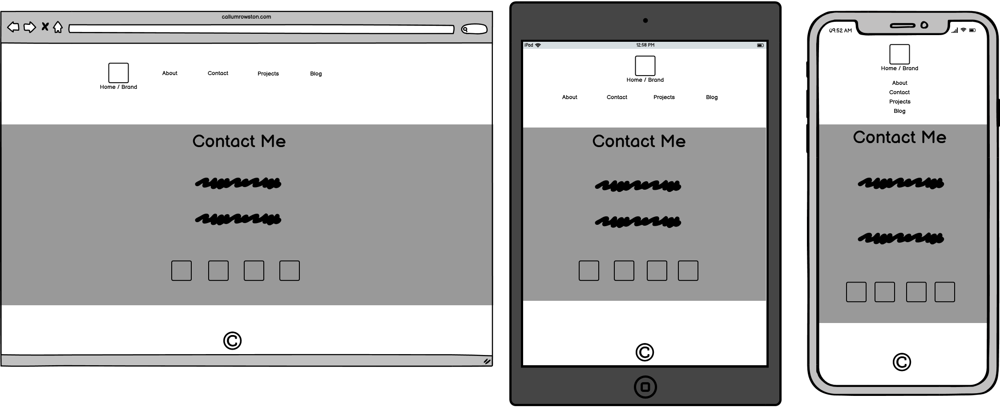
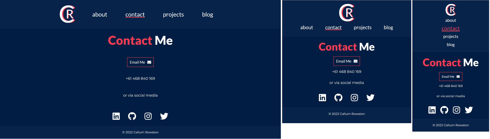

### Projects Page

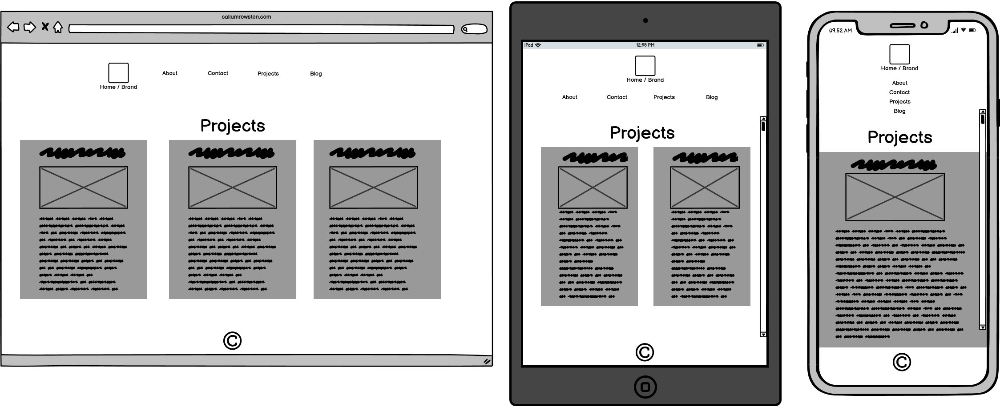
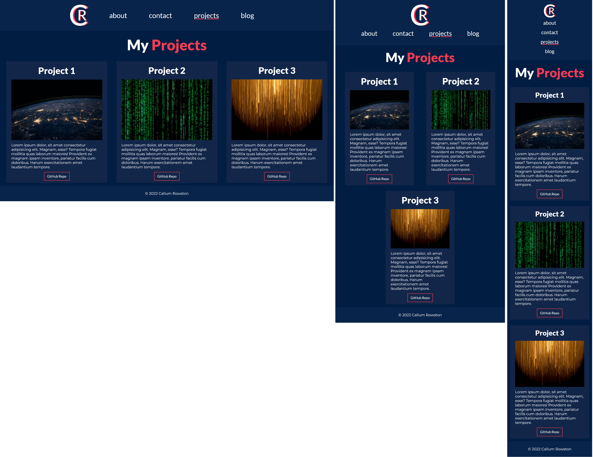

### Blog Main Page

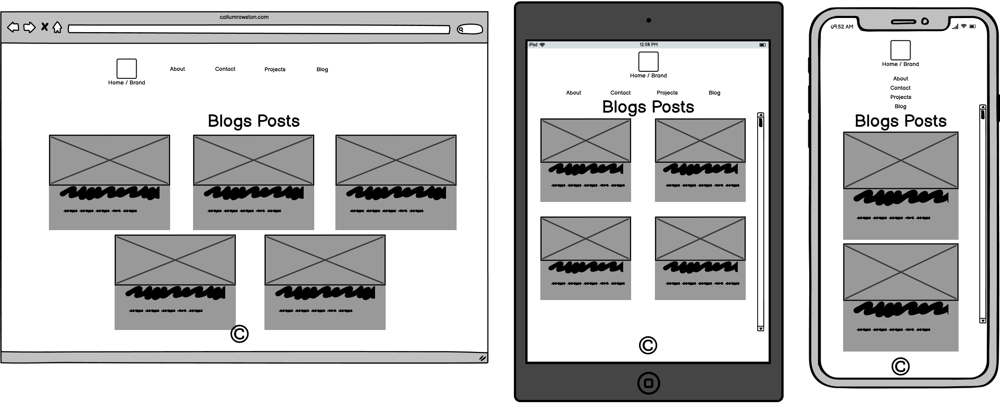

### Blog Individual Page

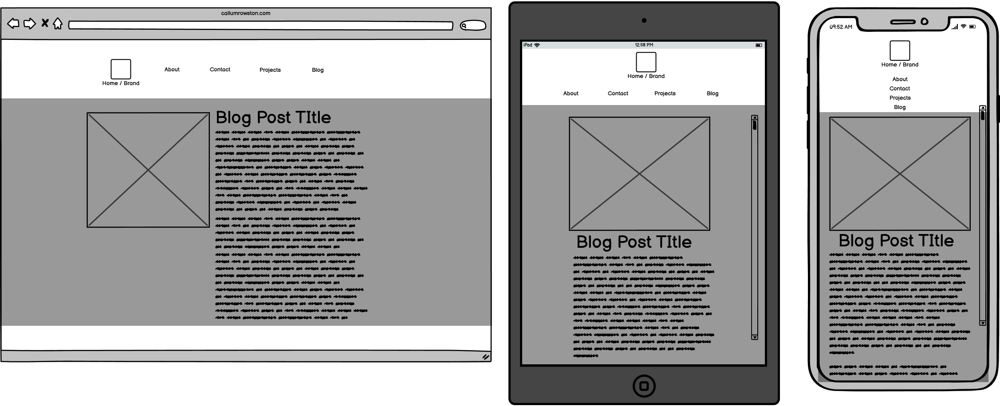
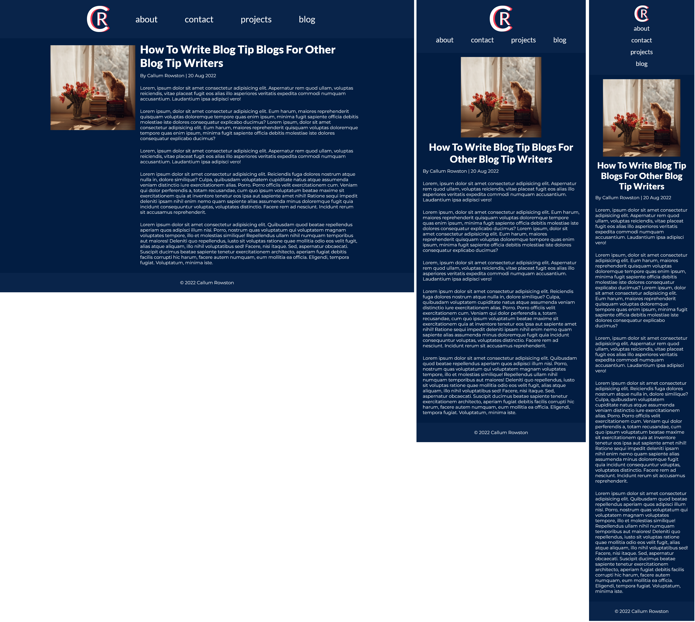

## Tech Stack

- Sitemap and Wireframes - Balsamiq
- Website - HTML5 and CSS3
- Image Optimisation - Optimizilla (https://imagecompressor.com/)
- Deployment - Netlify
